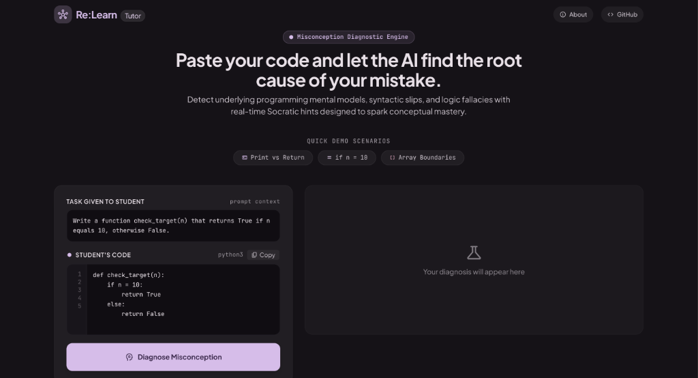
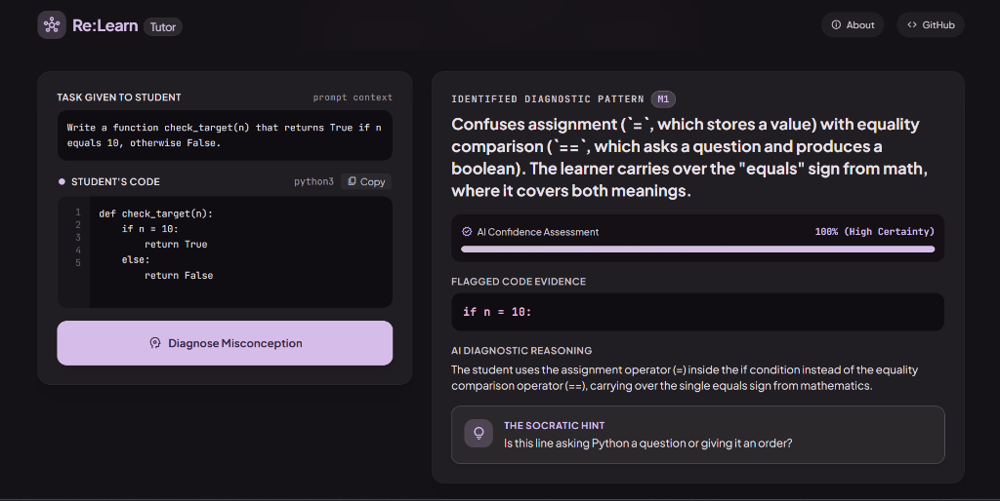
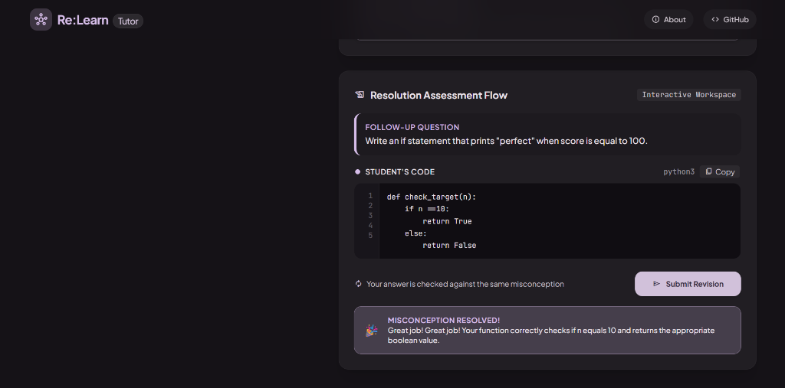

# QuickEng_maharashtra_round
Projects and resources for the Bit N Build 2026 Internal Maharashtra Round.
# 🌌 Re:Learn Tutor

> **An AI-powered diagnostic tutor that finds the flawed mental model behind a beginner's Python mistake, not just the syntax error.**

Standard compilers tell you *where* your code broke. **Re:Learn** tells you *why* your thinking went wrong, and uses Socratic hints to guide you to the fix yourself.

[🌐 Live Demo (Vercel)](YOUR_VERCEL_LINK) · [⚙️ API (Render)](YOUR_RENDER_LINK) · [🎥 Demo Video](YOUR_VIDEO_LINK) · [📊 Dataset](#-the-dataset)

---

## 🎯 The Problem

Beginners often repeat the same kind of mistake in many different programs. Error messages say *what* failed, but they are written for experienced developers. Many silent bugs, such as `[[0]*3]*3` or `round(2.5)`, produce no error at all. Beginners are left guessing, or they copy a full answer from a chatbot and learn nothing.

## 💡 Our Solution

Re:Learn takes the student's code and:

1. Says **"your code is correct"** if it is.
2. Otherwise finds the **underlying misconception** behind the mistake.
3. Gives **graded hints** (a question, then the concept, then the fix) so the student does the thinking.
4. Asks the student to **try again** in a workspace and checks whether the misconception is truly resolved.

---

## 📸 Project Showcase

**1. Deep Misconception Analysis**
*Paste your code and let the AI find the root cause of your mistake.*



**2. Real-time Socratic Hints**
*Instead of only showing a syntax error, Re:Learn explains the flawed mental model and gives hints that guide the student.*



**3. Interactive Resolution Assessment**
*The student tries again in the interactive workspace. The AI re-evaluates the new code to check that the misconception is resolved.*



---

## ✨ Key Features

- **Beyond Syntax:** Detects logical mistakes that standard linters miss, such as mutable default arguments, scope problems, late-binding closures and shared references in nested lists.
- **Socratic Hinting:** Does not hand over the answer. It guides the student step by step toward the "aha" moment.
- **Resolution Assessment:** A built-in workspace that re-checks the student's revised code, so the student shows they understood the concept.
- **Correct-Code Recognition:** Confirms when the submitted code is already correct.
- **"Nocturne Luminary" UI:** A custom, distraction-free dark-mode learning environment built with Tailwind CSS.
- **Publicly hosted:** Frontend on Vercel and backend on Render, so anyone can try it with no setup.

---

## 📊 The Dataset

Our diagnostic engine is grounded in a **custom, hand-built dataset of 300 common Python beginner misconceptions**.

| Column | Purpose |
|---|---|
| `ID` | Unique misconception entry |
| `Incorrect_Code` | A realistic beginner mistake |
| `Correct_Code` | The corrected version |
| `Underlying_Misconception` | The wrong mental model behind the mistake |
| `Hint_L1_Socratic` | A guiding question that does not reveal the answer |
| `Hint_L2_Conceptual` | A short explanation of the concept |
| `Hint_L3_Targeted` | The exact fix to apply |
| `Resolution_Question` | A new practice task to check understanding |

**Coverage:** loops, functions, classes, dictionaries, strings, file handling, scope, closures, comprehensions and more. About half of the entries are silent logic bugs that produce no error message, and the rest produce errors such as `TypeError`, `SyntaxError`, `ValueError` and `AttributeError`.

**Why misconceptions, not just fixes?** The same wrong mental model (for example "assignment is the same as equality") appears in many different programs. Teaching the model fixes the cause, not one line of code.

---

## 🛠️ Tech Stack

- **Frontend:** React, TypeScript, Vite, Tailwind CSS
- **Backend:** Python, FastAPI, Uvicorn
- **AI Engine:** Google Gemini Flash Lite (via the `google-genai` SDK)
- **Hosting:** Vercel (frontend) and Render (backend)

---

## 🧠 AI & Model Architecture

```
Student code
     │
     ▼
React frontend (Vercel) ──► FastAPI backend (Render) ──► Gemini (grounded on the 300-row dataset)
     ▲                                                          │
     │                                                          ▼
     └──────────────────── validated JSON ◄─────────────────────┘
```

**1. Grounded Diagnostic Engine (`/diagnose`)**

Instead of acting as a generic chatbot, the model is grounded in our **300-row pedagogical dataset**. When a student submits code, the model maps the logical flaw to a known misconception ID and returns a structured JSON response containing:

- A confidence score
- Flagged code evidence (the line where the mental model breaks)
- Diagnostic reasoning
- A targeted Socratic hint

**2. Structured JSON Output**

To keep the UI stable, we set `response_mime_type="application/json"` and use a low temperature (`temperature=0.1`) for consistent, machine-readable responses. The backend validates the JSON before sending it to the frontend.

**3. Resolution Assessment**

After the student edits their code, it is evaluated again to check that the original misconception no longer appears.

---

## ☁️ Deployment

The app is deployed publicly:

- **Frontend:** hosted on **Vercel** →https://quick-eng-maharashtra-round.vercel.app/ 
- **Backend (FastAPI):** hosted on **Render** → https://quickeng-maharashtra-round.onrender.com/

**Note:** On Render's free plan the backend may go to sleep when idle, so the first request can take 30 to 60 seconds. Please wait a moment and try again.

---

## ⚠️ Limitations

We want to be honest about what this version does and does not do:

- Works best on **short snippets** of beginner-level Python, not large multi-file programs.
- The dataset covers **common beginner mistakes**. Mistakes outside it may get a more general explanation.
- AI output can occasionally be wrong, so hints should be treated as guidance.
- We have not yet run a large study with real learners to measure learning gains.
- The free-tier backend may be slow on the first request after being idle.

## 🔮 Future Work

- Grow the dataset with more topics and levels, including intermediate Python.
- A progress dashboard that shows which misconceptions each learner repeats.
- Learner studies to measure how many hints students need over time.
- Safe code execution (sandboxing) for stronger correctness checks.
- Support for more programming languages.

---

## 👥 Team

| Name | Role | Contribution |
|---|---|---|
| **Aditya Jadhav** | Backend Developer | Built the FastAPI backend, the Gemini integration and the deployment on Render |
| **Atharva Chavan** | Data Architect | Designed the structure of the misconception dataset and how it grounds the AI |
| **Harsh Bhopi** | Data & Sheets Integrator | Built and curated the 300-entry dataset and prepared it for use by the AI engine |
| **Shruti Sabat** | UI/UX Designer | Designed the "Nocturne Luminary" interface and the user experience |

*Built for:-Bit N Build, 2026*

## 📄 License

This project is licensed under the MIT License. See the `LICENSE` file for details.
